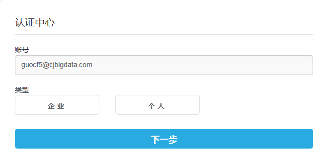
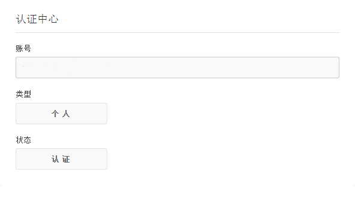

##2. 会员认证

###第一步 成为注册用户
在 广数DataHub 网站 ( http://www.gzbdex.com )通过邮箱注册且激活后，成为注册用户。

#####数据需求方：

如果数据是需付费购买的，那么在点击“立刻订购”时会提示“账户余额不足，签约失败!”，需前往“会员升级”页面进行认证，并发送充值需求至 service@gzbdex.com。

####数据提供方：

如果需要通过 广数DataHub 平台发布数据，您的用户级别需为认证会员及以上。否则在“我的发布”中点击“+”发布数据时会提示“可用资源不足，请通过会员升级获取更多资源”。

###第二步 进入“认证中心”认证
 选择认证类型（个人/企业），填写认证信息，提交审核。认证申请在7个工作日内获得审核结果。

###第三 查看认证审核结果
在广数DataHub 平台的“会员中心”-“认证中心”页面中查看自己的认证状态。

* 如果审核通过后，您会收到邮件和站内消息通知，代表您已成为了 广数DataHub 平台的认证会员。
* 如果审核不通过，您可以重新填写认证信息，提交审核。

