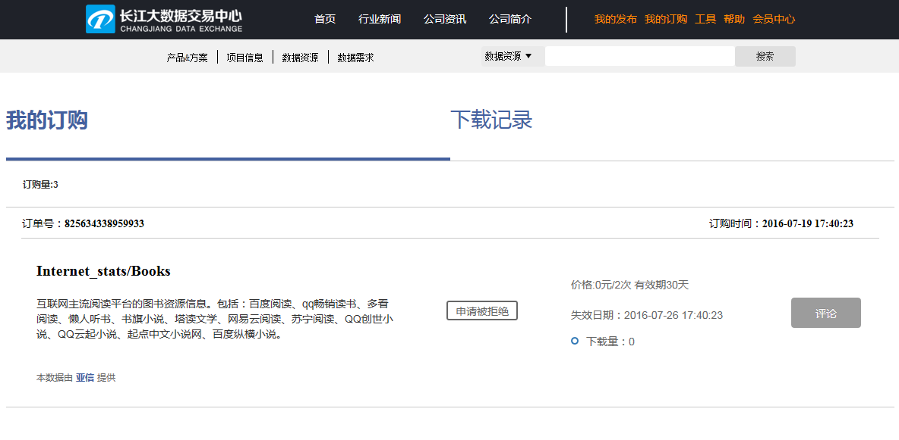

##4. 下载数据

DataHub 提供的数据类型包括：批量数据、 API 数据和流式数据。

下载数据是数据需求方的行为，需要在网页端和 Client 客户端分步操作。在网页端您可以完成数据的"立刻订购"或"申请订购"，而 下载数据则需要通过 Client 客户端来完成。

###第一步：订购数据（网页端操作）

1)进入 广数DataHub 网站，查看、搜索 Repository 、 DataItem 后，选择需要订购的数据，根据数据提供方设定的不同权限，点击“立刻订购”或“申请订购”。  
  

2)签订数据订购合约。甲方为数据需求方，乙方为数据提供方。  
  

3)查看签约结果。订购成功后，可立即在 Client 客户端开始 pull 数据。  
  

 

4)您可以在“我的订购”中查看全部的订单信息。  
  

 
###第二步：数据下载（ Client 客户端操作）
1)创建 Datapool
  
如果需要下载数据，则必须创建相应的 Datapool 。

	datahub dp create mydp file:///home/usr/data/itempull

以上命令创建了一个名为 mydp 的 Datapool ，类型是 file ，路径是`/home/myusr/data/itempull , 用于存储即将下载 的数据。

如果成功，会显示：

	DataHub : Datapool has been created successfully. 	Name:datahubdp1 Type:file Path:/home/usr/data/itempull. 
  

2)数据下载
  
	datahub pull repotest/itemtest:tagtest mydp://mydir1 --destname=tagdestname

以上命令下载了一个 tag 对应的数据到 mydp 中，子路径是 mydir1 。

如果成功，会显示：

	DataHub : repotest/itemtest:tagtest will be pulled as /home/usr/data/itempull/mydir1/tagdestname

下载完成后，您将会看到已经下载到/home/usr/data/itempull/mydir1的 tagdestname 文件。

### 数据下载注意事项：

* [pull命令详细介绍](pub.md) 
* [下载数据样例场景](example1.md)
* “申请订购”需等待数据提供方批准，批准后数据需求方才可在 Client 客户端开始下载数据。在数据提供方批准前，数据需求方可在 DataItem 详情页点击“取消订购”，撤销“申请订购”。
