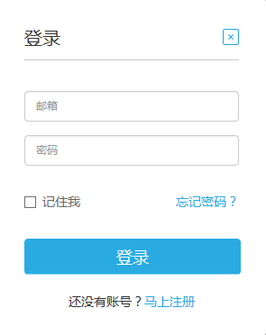

##1. 用户注册

###数据需求方：

广数DataHub 平台的会员级别分为四级，分别是：注册用户、认证会员、金卡会员、钻石会员。

不同级别的会员拥有不同的会员特权：

- 注册为 广数DataHub 用户，可以获取免费数据。
- 免费升级为认证会员，可以获取付费数据，付费类型为预付费。
- 付费升级为金卡会员，可以获取更多免费、付费数据，付费类型为预付费。
- 付费升级为钻石会员，可以获取更多付费数据，付费类型为可后付费。

###数据提供方：

广数DataHub 平台的会员级别分为四级，分别是：注册用户、认证会员、金卡会员、钻石会员。

不同级别的会员拥有不同的会员特权：

- 注册为 广数DataHub 用户，无发布数据权限。
- 免费升级为认证会员，可以获得发布开放数据资源量。
 * 开放数据：所用用户可见；可以邀请他人协作发布数据项。
- 付费升级为金卡会员，可以获得数据托管空间、发布私有数据等资源量。
- 付费升级为钻石会员，可以获得更多数据托管空间、发布私有数据等资源量。
 * 私有数据：自己和指定白名单用户可见。

1)登录网址：[http://www.gzbdex.com](http://www.gzbdex.com)

2)点击“登录”、“马上注册”，填写注册信息即可完成申请（已有 广数DataHub 账号可直接登录）。

