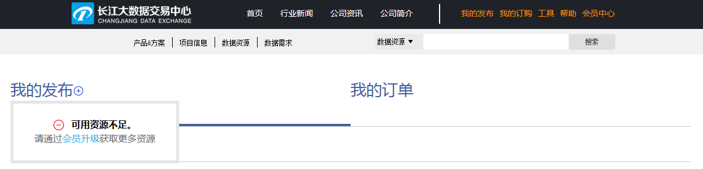
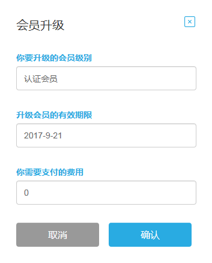
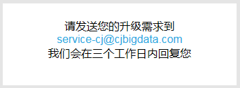
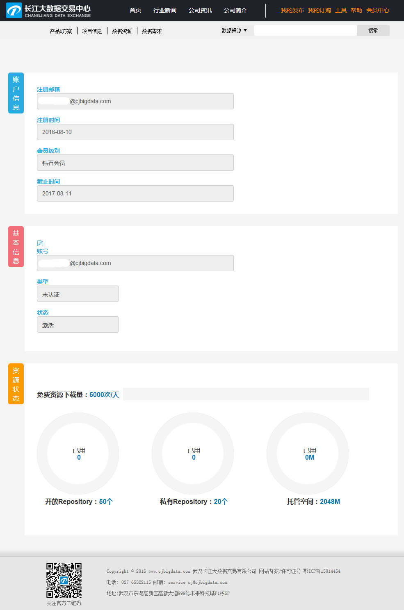

##3. 会员升级

###第一步 成为 广数DataHub 注册用户
在 广数DataHub 网站 ( hub.dataos.io )通过邮箱注册且激活后，成为注册用户。注册用户可购买及下载免费数据了。

#####数据需求方 ：

如果数据是需付费购买的，那么在点击“立刻订购”时会提示“账户余额不足，签约失败!”，需前往“会员升级”页面进行认证，并发送充值需求至 service@gzbdex.com。

#####数据提供方：

如果需要通过 广数DataHub 平台发布数据，您的用户级别需为认证会员及以上。否则在“我的发布”中点击“+”发布数据时会提示“可用资源不足，请通过会员升级获取更多资源”。

###第二步 进入“会员升级”，选择要会员级别点击“马上升级”。

###第三步 根据提示发送您的升级需求到 service@gzbdex.com，我们会在三个工作日内回复您。

###第四步 审核通过后，您会收到邮件和站内消息通知。

###第五步 用户可在 广数DataHub 平台的“个人中心”-“基本信息”页面中查看自己的会员级别信息和资源状态。

